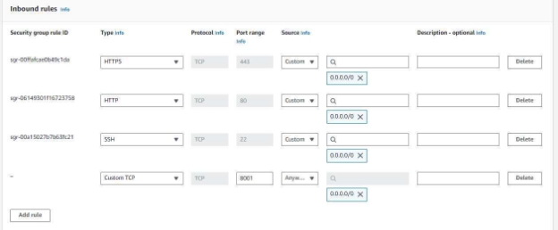
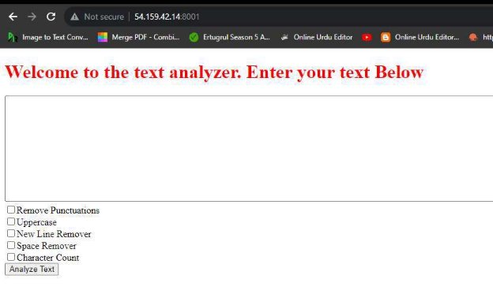
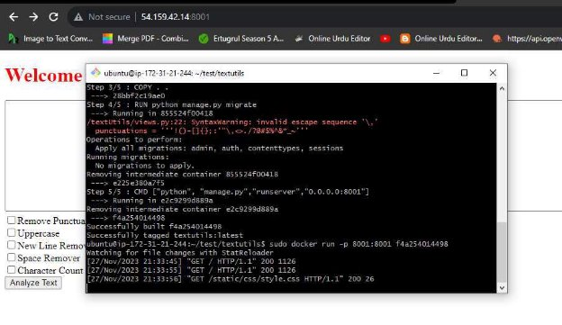

<h1>Introduction: </h1>

Introducing TextUtils, a dynamic web application crafted on the Django framework that empowers users to effortlessly manipulate and enhance their text content. This versatile tool offers a range of essential text processing functions, including the removal of punctuations for cleaner prose, uppercase conversion for impactful messaging, new line removal, space removal for concise formatting, and a character count feature to keep tabs on textual length. TextUtils is deployed on AWS seamlessly, utilizing both manual and automated methods through Docker, ensuring a robust and efficient deployment process. 

<h1>Manually Deployment:</h1>

<h2>Step 1: Cloning the Project</h2>

Clone the project repository to get started. 

<h2>Step 2: Installing Django</h2>

Install Django to environment to proceed with the setup. 

<h2>Step 3: Migrating pkgs</h2>

Migrate packages for Django to finalize the configuration with following command:

		`python3 manage.py migrate`

<h2>Step 4: Running the Server</h2>

Launch the server with the following command:  

`python3 manage.py runserver 0.0.0.0:8001`

<h2>Step 5: Adding Security Rules </h2>

In the Adding security rule menu of ec2 instance, a security rule is introduced by adding port in inbound rule menu. 

<h2>Step 6: Resolving Error </h2>

To resolve a disallowed host error, I permitted all hosts by setting `ALLOWED_HOSTS = ["*"]` in the Django project's settings. This configuration allows the application to accept requests from any host.

After this Application is now running   

<h1>Automatically Deployment (By using Dockers):</h1>

<h2>Step 1: Installing Docker </h2>

Successfully installed Docker using the command: 

`sudo apt install docker.io`. 

<h2>Step 2: Creatinng Docker File: </h2>

The Dockerfile has been created, as shown below in snapshot. 

<h2>Step 3: Building Docker file </h2>

Docker file is built by following command as shown below: 

`sudo docker build . -t textu  ls`

<h2>Step 4: Running by using Docker </h2>

Docker file is run by following command as shown below: 

`sudo docker run -p 8001:8001 f4a25014498`

For Running in background, you can use following code: 

`sudo docker run -d -p 8001:8001 f4a25014498`

