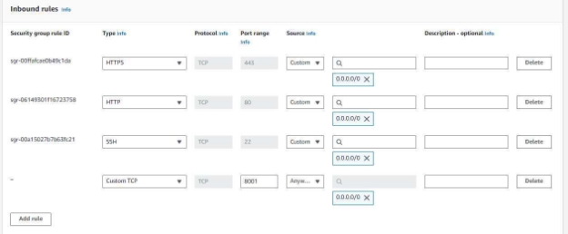
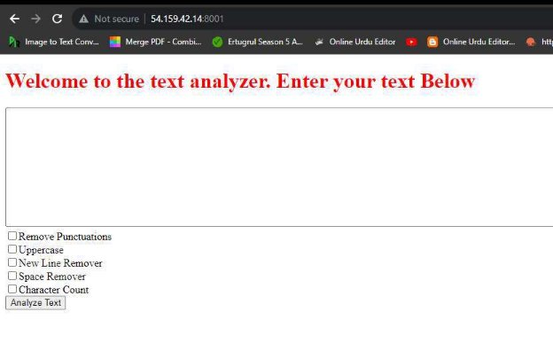

Introduc  on: 

Introducing TextU  ls, a dynamic web applica  on cra  ed on the Django framework that empowers users to effortlessly manipulate and enhance their text content. This versa  le tool offers a range of essen  al text processing func  ons, including the removal of punctua  ons for cleaner prose, uppercase conversion for impac  ul messaging, new line removal, space removal for concise forma  ng, and a character count feature to keep tabs on textual length. TextU  ls is deployed on AWS seamlessly, u  lizing both manual and automated methods through Docker, ensuring a robust and efficient deployment process. 

Manually Deployment: 

Step 1: Cloning the Project 

Clone the project repository to get started. 

Step 2: Installing Django 

Install Django to environment to proceed with the setup. 

Step 3: Migra  ng pkgs 

Migrate packages for Django to finalize the configura  on with following command: 

python3 manage.py migrate

Step 4: Running the Server 

Launch the server with the following command:  

python3 manage.py runserver 0.0.0.0:8001 

Step 5: Adding Security Rules 

In the Adding security rule menu of ec2 instance, a security rule is introduced by adding port in inbound rule menu. 

Step 6: Resolving Error 

To resolve a disallowed host error, I permi  ed all hosts by se   ng `ALLOWED\_HOSTS = ["\*"]` in the Django project's se  ngs. This configura  on allows the applica  on to accept requests from 

any host.

A  er this Applica  on is now running  

Automa  cally Deployment (By using Dockers): 

Step 1: Installing Docker 

Successfully installed Docker using the command: `sudo apt install docker.io`. 

Step 2: Crea  ng Docker File: 

The Dockerfile has been created, as shown below in snapshot. 

Step 3: Building Docker file 

Docker file is built by following command as shown below: 

“sudo docker build . -t textu  ls” 

Step 4: Running by using Docker 

Docker file is run by following command as shown below: 

“sudo docker run -p 8001:8001 f4a25014498” 

For Running in background, you can use following code: 

“sudo docker run -d -p 8001:8001 f4a25014498” 

